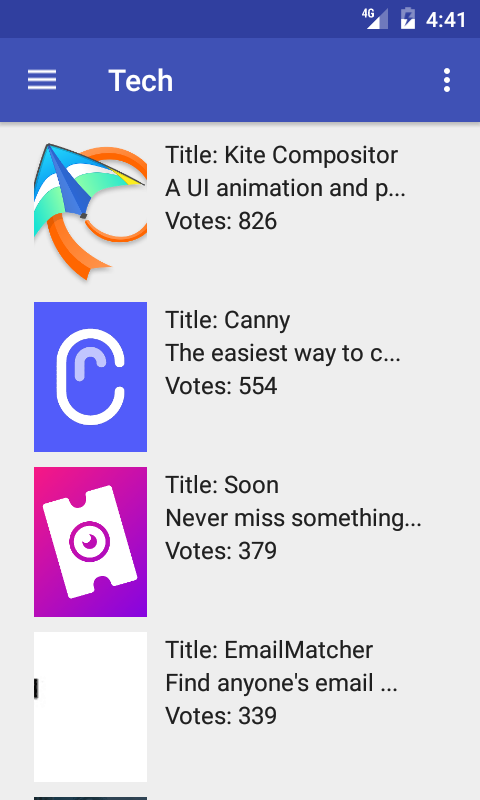
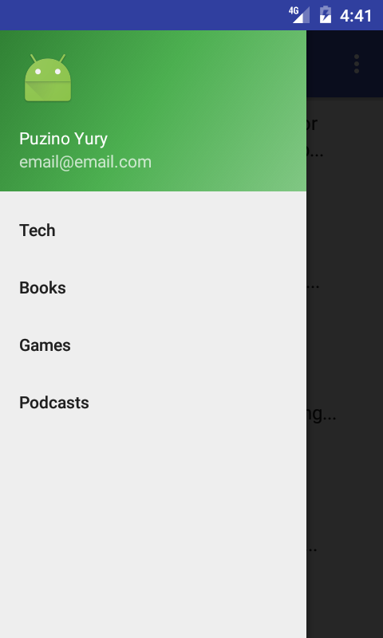
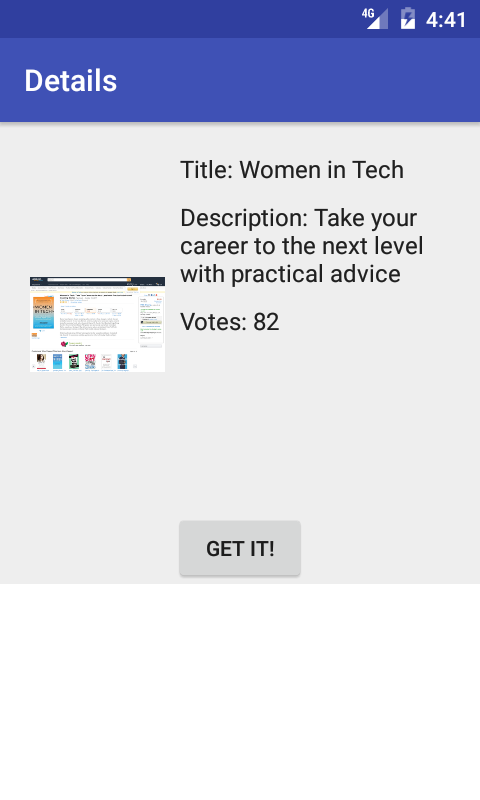
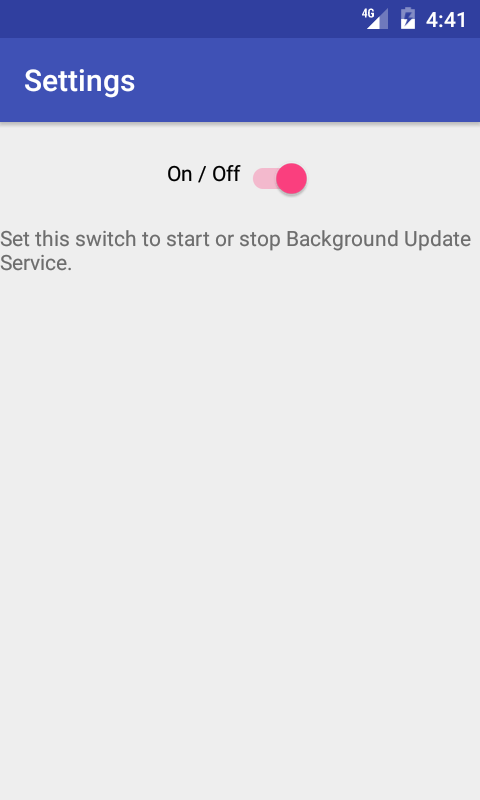

# ggladsTest

###Test app ProductHunt API:
Develop simple client for ProductHunt (http://producthunt.com). It must read new products list by categories and receive notifications about new products.

###Unfinished
1) Background Service
2) Notifications

## Screenshots:

